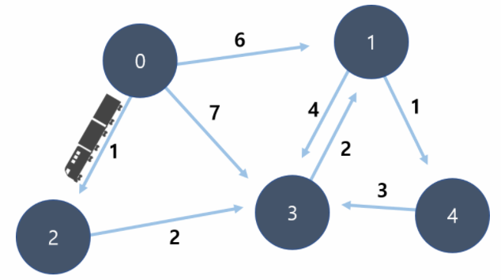
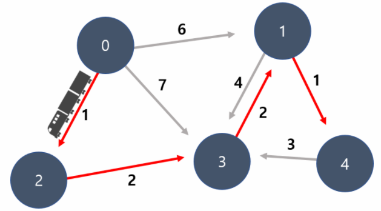
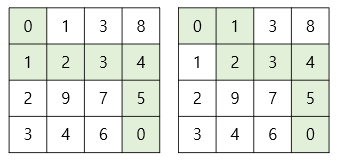
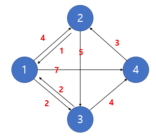
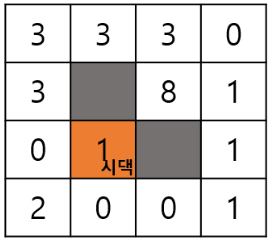
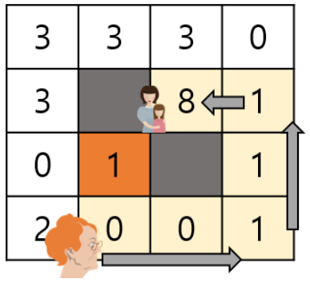

# 1-4. Dijkstra 문제

## 1. 알뜰 기차여행
코코는 아르바이트로 모은 돈으로 아영이와 기차 여행을 하고 있습니다.  
아래 그래프에는 이동 경로마다 기차 비용이 적혀있습니다.  
출발 지점에서 도착지점까지 가장 저렴한 방법으로 이동하려고 합니다.  



만약 0번에서 출발하고 4번 지점이 도착지라면,  
아래와 같은 경로로 이동하는 것이 최소 비용의 경로입니다.  
이 비용이라면, 돈을 아껴 맛있는 식사를 할 수 있을 것 같습니다.  



아영이 커플을 위해,가장 저렴한 노선의 비용을 알려주는 프로그램을 제작해 주세요.  

**입력**
첫 줄에는 정점의 개수 N과 간선의 수 T를 입력 받습니다. (1 <= N <= 20,000 , 1 <= T <= 300,000)  
모든 정점에는 0번 부터 N-1번까지 번호가 매겨져 있다고 가정합니다.  
둘째 줄부터 T 개의 노선 정보를 입력 받는데, 각 줄마다 3개의 정수 (a, b, w)로 입력 받습니다. ( a와 b는 서로 다르며, 1 <= w <= 10,000 의 자연수)  
이는 시간이 w 만큼 걸리는a 에서 b로 가는 간선이 존재한다는 뜻입니다.  
예를들어 0 2 4 인 경우 0번에서 2번 노드까지 도착하는데 걸리는 시간은 4 입니다.  

**출력**
0번 노드에서 출발하여 N - 1 노드에 도착해야 합니다.  
이때, 가장 저렴하게 갈수 있는 비용을 출력해 주세요.  
만약 갈수 있는 길이 없다면, "impossible" 을 출력합니다.  

**입력 예시 1**

```
5 8
0 1 6
0 2 1
0 3 7
2 3 2
3 1 2
1 3 4
1 4 1
4 3 3
```

**출력 예시 1**

```
6
```

**입력 예시 2**
```
4 6
0 2 5
0 1 7
2 1 4
3 0 2
3 2 9
3 1 5
```

**출력 예시 2**

```
impossible
```

## 2. N x M 최단 거리
N(행) x M(열) 크기의 2차원 맵이 주어졌을 때, (1, 1)위치에서 시작하여 (N, M)위치에 도달하기까지의 최단 거리를 출력하는 프로그램을 작성하시오.  
각 격자에는 해당 위치로 이동하기 위한 거리가 주어지며, 상하좌우 방향으로만 이동이 가능합니다.  
다익스트라 알고리즘을 활용하여 풀어 주세요.  

**예시**
다음은 예제 입력 1을 시각화 한 것입니다.  
예제 입력에서 주어진 맵에서, (1,1)으로부터 (N,M)까지의 최단 거리는 15입니다.  



**입력**
첫번째 줄에 행의 크기 N과 열의 크기 M이 공백으로 구분되어 주어집니다. (1 <= N, M <= 100)  
두번째 줄부터 N개의 줄에 걸처 M개의 양의 정수가 공백으로 구분되어 주어집니다.  
정수는 1 이상, 10 이하의 정수가 주어집니다.  

**출력**
첫번째 줄에 (1,1) 위치로부터 (N, M) 위치까지의 최단 거리를 출력합니다.  

**입력 예시 1**
```
4 4
0 1 3 8
1 2 3 4
2 9 7 5
3 4 6 0 
```

**출력 예시 1**

```
15
```

**핵심**  
시작점에 숫자가 주어질때도 고려야해 한다. 항상 0 이 아닐 수도 있다.  

## 3. 오프라인 모임
코딩프로는 알고리즘 문제들을 풀어볼 수 있는 문제 풀이 사이트이다.  
여기서 활발하게 활동하던 N명의 학생들이 온라인상에서 같이 문제를 풀며 친분을 쌓았다.  
N명의 학생들은 날짜를 잡아 오프라인 모임을 가지기로 하였다.  


이들은 모두 각각 다른 마을에 살고 있어, N개의 마을 중 하나를 랜덤으로 선택한 마을 P에서 만나기로 하였다.  
이 마을들 사이에는 총 M개의 단방향 도로들이 존재한다. 그리고 각 도로들을 지나는 데에는 특정 시간이 소비된다.  
모임을 가지게 될 마을 P가 선택되면, 모든 학생들은 P마을까지 이동하고, 그리고 다시 자신의 마을로 돌아와야 한다.  
단, 마을을 잇는 도로들은 단방향이기 때문에, 각자의 마을에서 P마을로 가는 길과 P마을에서 다시 자신의 마을로 이동하는 경로는 다를 수 있다.  

매일 알고리즘 문제들을 푸는데에 지치고 체력이 약해진 학생들은 최단 시간으로 이동할 수 있는 루트로 이동한다.  
자신의 마을에서 P마을까지 왔다가 다시 돌아가는데에 가장 많은 시간을 소비한 학생을 배려하여 모임에서 먹을 치킨 값을 빼주려고 한다.  
치킨 값을 면제 받을 수 있는 학생은 누구인지 구하는 프로그램을 작성하라.  

**예시**  
다음은 예제 입력을 시각화 한 것이다.  
N=4, M=8, P=2  



각 마을에서 P=2 마을까지 이동하는 최소 시간은 다음과 같다.  

- 1 : 1 -> 2 (4)  
- 2 : (0)  
- 3 : 3 -> 1 -> 2 (2 + 4 = 6)  
- 4 : 4 -> 2 (3)  

그리고 마을 P에서 각자의 마을까지 돌아가는 최소 시간은 다음과 같다.  

- 1 : 2 -> 1 (1)  
- 2 : (0)  
- 3 : 2 -> 1 -> 3 (1 + 2 = 3)  
- 4 : 2 -> 1 -> 3 -> 4 (1 + 2 + 4 = 7)  

각 마을에서 마을 P까지 오고 가는 총 시간은 다음과 같다.  

- 1 : 4 + 1 = 5  
- 2 : 0 + 0 = 0  
- 3 : 6 + 3 = 9  
- 4 : 3 + 7 = 10  

오고 가는 시간이 가장 많이 소비되는 학생은 4번 학생의 10으로, 10을 출력한다.  

**입력**
첫번째 줄에 학생과 마을의 개수 N,  마을을 잇는 도로의 개수 M, 그리고 마을 P가 공백으로 구분되어 주어진다. (1 ≤ N ≤ 1,000,1 ≤ M ≤ 10,000,1 ≤ P ≤ N)  
두번째 줄부터 M+1줄에 걸쳐 i번째 도로의 시작점, 끝점, 그리고 이 도로를 지나는데에 소비되는 시간이 공백으로 구분되어 주어진다.  
시작점과 끝점이 동일한 도로는 주어지지 않으며, 시작점과 마을 A에서 다른 마을 B로 가는 도로의 개수는 최대 1개이다.  
모든 학생들이 각자의 마을에서 마을 P로, 그리고 마을 P로부터 각자의 마을로 돌아올 수 있는 입력이 주어진다.  

**출력**
첫 번째 줄에 N명의 학생들 P마을로 오고 가는데 가장 오래 걸리는 학생의  소비 시간을 출력한다.  

**입력 예시 1**
```
4 8 2
1 2 4
1 3 2
1 4 7
2 1 1
2 3 5
3 1 2
3 4 4
4 2 3
```

**출력 예시 1**
```
10
```

**핵심**  
각 노드에서 다익스트라를 모두 실행해야 하는가? 그렇게 해도 되지만, 더 좋은 방법이 있다.  
루프 쓸 필요 없이, 다익스트라를 단 두번만 쓰면 풀 수 있다.  
그래프를 역으로 그려보면, 모든 노드가 도착 노드로 오는 데 걸리는 시간을 구할 수 있다.  

## 4. 무서운 시어머니
시어머니께 죄송한 말씀이지만, 자유로운 생활을 위해 독립을 하기로 결심했습니다.  
산악회 회장 출신인 시어머니는새로 이사를 가더라도,최적의 루트로 우리집에 자주 방문할 것이 분명했습니다.  
따라서 시어머니가 오시기 가장 힘든 곳으로 이사가려고 합니다.  



시어머니는 위, 아래, 왼쪽, 오른쪽 방향으로만 이동할 수 있으며,  
각 칸에 쓰여진 숫자는 해당 위치로 이동했을 때 쌓이는 피로도 수치 입니다.  



시어머니는 피로도가 최소가 되게끔 올 수 있는 경로로 우리집을 방문합니다.  
피로도가 가장 높게 쌓이는 위치로 이사를 가는 경우,  
시어머니가 우리집을 방문할 때 얻는피로도들의 총합을 출력해 주세요.  
(위 예시에서는 1 + 0 + 0 + 1 + 1 + 1 + 8 = 12 만큼 피로도를 얻습니다.)  

**입력**
첫 줄에는 시댁의 위치 좌표를 (Y, X)를 입력 받습니다.  
다음 줄에는 마을의 크기 N 을 입력 받습니다. (3 <= N <= 1,000)  
다음 줄부터 N x N 의 마을의 상태를 입력 받습니다.  
- 1은 벽이고, 그외의 수는 특정 칸에 방문했을때 얻는 피로도 입니다. (0 <= 피로도 <= 1,000)  

**출력**
시어머니가 오기 힘든 위치로 이사를 갈 경우,  
시어머니가 방문시 얻게되는 피로도의 총합을 출력해 주세요.  

**입력 예시 1**
```
2 1
4
3 3 3 0
3 -1 8 1
0 1 -1 1
2 0 0 1
```

**출력 예시 1**
```
12
```

**입력 예시 2**
```
0 0
5
1 -1 2 1 2
3 -1 1 -1 1
0 2 0 -1 0
0 -1 0 -1 0
0 0 0 -1 5
```

**출력 예시 2**

```
16
```

**핵심**  
벽 신경쓰고, 시작점에 cost 있다는것도 신경써야 함  
maxVal 꺼내고싶어도 21e8 일 경우 걸러야 함  
