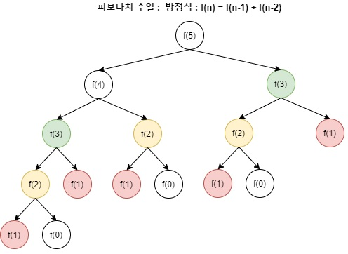

# 1-5. DP

## 1. 개념

피보나치 수열: 첫째 항과 둘째 항이 1이며, 그 뒤의 모든 항은 바로 앞 두 항의 수열  

피보나치 수열을 재귀로 구한다고 가정  

```java
// java
import java.io.*;
import java.util.*;

public class Main {
    static int n = 10; // 출력할 피보나치 수열의 항 수

    // 재귀 함수로 피보나치 수 계산
    public static int fib(int n) {
        if (n <= 1) {
            return n;
        }
        return fib(n - 1) + fib(n - 2);
    }

    public static void main(String[] args) {
        System.out.print("Fibonacci Sequence: ");
        for (int i = 1; i <= n; i++) {
            System.out.print(fib(i) + " ");
        }
    }
}
```

```python
# python
def fib(n):
    # 재귀 함수로 피보나치 수 계산
    if n <= 1:
        return n
    return fib(n - 1) + fib(n - 2)


n = 10  # 출력할 피보나치 수열의 항 수
sequence = [fib(i) for i in range(1, 11)]
print("Fibonacci Sequence:", sequence)
```

문제는, 숫자가 커질수록 이미 그 전에 시행했던 연산을 반복한다는 것이다.  



5번째 피보나치 수열을 구한다고 가정하면, 현재 색상이 동일한 영역은 다른 연산에서 반복해 구하는것을 알 수 있다.  

그런데, 생각해보면 그럴 필요가 전혀 없다. 매번 구할 것이 아니라, 한번 계산한 결과를 재사용하면 될 일이다.  

이 아이디어가 바로 DP 이다. 구해놓은 것을 "메모했다가" 가져다 쓰는 것이다. (memoization)  

* DP 라는 단어에 너무 집착할 필요는 없다. 다이나믹 프로그래밍이라는 단어에 꽃혀서 오히려 이해하는데 방해될 수도 있다. 메모한것을 가져다 쓴다고만 이해해도 충분하다. (memoization)  


# 2. 사용 조건

두 가지 조건을 만족해야 사용 가능하다.  

1. Overlapping Subproblems (중복되는 부분 문제)  
2. Optimal Substructure (최적 부분 구조)  

## 2-1. Overlapping Subproblems (중복되는 부분 문제)
동일한 작은 문제들이 반복할 경우 사용 가능  
왜냐, 과정 중에 구한 값을 재활용하기 때문이다.  
위 피보나치 수열의 경우, 부분 문제가 반복해서 발생하기 때문에 DP 사용에 적합하다고 할 수 있다.  
만약, 부분 문제가 반복되지 않는다면 DP 를 사용할 수 없다.  
ex) 이진 탐색은 답을 찾으면 리턴하고 끝날 뿐, 해당 결과를 재사용할 일이 없다.  

## 2-2. Optimal Substructure (최적 부분 구조)
부분 문제의 최적 결과 값을 사용해 전체 문제의 최적 결과를 낼 수 있어야만 한다.  
즉, 작은 문제의 결과를 모았을 때 반드시 정답이 나와야만 한다.  

ex1) 피보나치 수열의 경우, f(n - 1) 과 f(n - 2) 라는 부분의 합이 정답일수밖에 없다.  

ex2) A -> B -> C 경로가 있다. 가장 빠른 길은 무엇인가?  
   - A -> B 로 가는 가장 빠른 길 (부분문제 1)   
   - B -> C 로 가는 가장 빠른 길 (부분문제 2)  
   - 위 둘을 더한 것    

# 3. 구현  

Bottom-Up 방식과 Top-Down 방식으로 나뉘는데, `dp[]` 배열을 기록해나간다는 방식은 동일하다. (memoization)  

## 3-1. Bottom-Up (반복문)
아래에서부터 계산을 수행하고, 누적시켜서, 전체 큰 문제를 해결  

피보나치의 점화식은 `f(n) = f(n - 1) + f(n - 2)` 이므로, 초기값을 세팅한 후, 누적해나가면 된다.  

```java
// java
import java.io.*;
import java.util.*;

public class Main {
    static int n = 10; // 피보나치 수열 항의 개수
    static int[] dp = new int[n + 1];

    public static void main(String[] args) {

        // 초기 값 설정
        dp[0] = 0;
        dp[1] = 1;
        dp[2] = 1;

        // Bottom-Up
        for (int i = 3; i < dp.length; i++) {
            dp[i] = dp[i - 1] + dp[i - 2];
        }

        System.out.print("Fibonacci Sequence: ");
        for (int i = 1; i <= n; i++) {
            System.out.print(dp[i] + " ");
        }
    }
}
```

```py
# python
n = 10  # 피보나치 수열 항의 개수
dp = [0] * (n + 1)

# 초기 값 설정
dp[0] = 0
dp[1] = 1
dp[2] = 1

# Bottom-Up
for i in range(3, n + 1):
    dp[i] = dp[i - 1] + dp[i - 2]

sequence = [dp[i] for i in range(1, n + 1)]
print("Fibonacci Sequence:", sequence)
```

## 3-2. Top-Down (재귀)
밑에서부터 하나하나 적어나가는 Bottom-Up 과는 다르게, Top-Down 방식은 재귀 함수를 호출할 때 `dp[]` 배열을 채워나간다.  

```java
// java
import java.io.*;
import java.util.*;

public class Main {
    static int n = 10; // 피보나치 수열 항의 개수
    static int[] dp = new int[n + 1];

    // Top-Down
    public static int fib(int n) {
        if (n <= 1) {
            return n;
        }
        // 이미 계산한 값이 있으면 바로 반환
        if (dp[n] != -1) {
            return dp[n];
        }
        dp[n] = fib(n - 1) + fib(n - 2);
        return dp[n];
    }

    public static void main(String[] args) {
        // dp 배열을 -1로 초기화하여 미계산 상태 표시
        Arrays.fill(dp, -1);
        System.out.print("Fibonacci Sequence: ");
        for (int i = 1; i <= n; i++) {
            System.out.print(fib(i) + " ");
        }
    }
}
```

```python
# python

# Top-Down
def fib(n):
    # 이미 계산한 값이 있으면 바로 반환
    if n in dp:
        return dp[n]
    if n <= 1:
        return n
    dp[n] = fib(n - 1) + fib(n - 2)
    return dp[n]


# 피보나치 수열 항의 개수
n = 10
# dp 사전 초기화: 아직 계산하지 않은 값들을 저장할 딕셔너리
dp = {}

sequence = [fib(i) for i in range(1, n + 1)]
print("Fibonacci Sequence:", sequence)
```
파이썬에선 딕셔너리를 썼다는 것만 달라졌을 뿐이다.    

## 3-3. Bottom-Up vs Top-Down
1. **Bottom-Up**
   - 장점
     - 재귀를 사용하지 않기 때문에 가독성이 좋음  
     - 모든 부분 문제를 해결하므로 최적 부분 구조 보장  
   - 단점
     - 모든 부분 문제를 해결하므로, 계산 시간이 많이 소요될 수 있음  
2. **Top-Down**  
   - 장점
     - 필요한 부분 문제만 해결하므로 계산 시간 절약 가능  
   - 단점
     - 재귀 호출이 지나치게 많을 경우, 스택 오버플로 발생  
     - 모든 부분 문제가 해결되지 않을 경우, 최적 부분 구조가 보장되지 않을수도 있음  

# 4. DP 의 장단점
- **장점**  
  - 중복 계산 줄이기  
  - 효율적인 시간 복잡도  
- **단점**  
  - n 이 커질수록 엄청난 공간복잡도 소요 (10억개를 메모할 수는 없다)  


# 5. 문제 유형

## 5-1. 배낭 문제 (0/1 Knapsack Problem)

### 문제 설명
0/1 배낭 문제는 N개의 물건이 각각 정해진 무게와 가치를 가지고 있고, 한정된 무게 W를 초과하지 않도록 물건들을 선택하여 총 가치를 최대화하는 문제이다.  
DP를 적용할 수 있는 이유는, 각 단계에서 "물건을 담는다/담지 않는다"라는 **중복되는 부분 문제**와, 이전 결정 결과를 기반으로 최적의 해를 구성하는 **최적 부분 구조**가 존재하기 때문이다.

### Bottom-Up 방식

- **Java 코드 (Bottom-Up)**
  
  ```java
  // Java - Bottom-Up 방식 (0/1 Knapsack Problem)
  import java.io.*;
  import java.util.*;
  
  public class Main {
      static int n = 4;                     // 물건의 개수
      static int W = 5;                     // 배낭의 최대 무게
      // 1번부터 n번 물건의 무게와 가치를 저장 (인덱스 0은 사용하지 않음)
      static int[] weight = {0, 2, 3, 4, 5};
      static int[] value = {0, 3, 4, 5, 6};
  
      public static void main(String[] args) {
          int[][] dp = new int[n + 1][W + 1];
  
          // 각 물건에 대해
          for (int i = 1; i <= n; i++) {
              for (int w = 0; w <= W; w++) {
                  if (weight[i] > w) {
                      dp[i][w] = dp[i - 1][w];
                  } else {
                      dp[i][w] = Math.max(dp[i - 1][w], dp[i - 1][w - weight[i]] + value[i]);
                  }
              }
          }
          System.out.println("0/1 Knapsack (Bottom-Up): Maximum value = " + dp[n][W]);
      }
  }
  ```
  
- **Python 코드 (Bottom-Up)**
  
  ```python
  # Python - Bottom-Up 방식 (0/1 Knapsack Problem)
  
  n = 4         # 물건의 개수
  W = 5         # 배낭의 최대 무게
  weights = [2, 3, 4, 5]
  values = [3, 4, 5, 6]
  
  # dp[i][w] : 첫 i개의 물건을 고려했을 때, 무게 제한 w에서 얻을 수 있는 최대 가치
  dp = [[0] * (W + 1) for _ in range(n + 1)]
  
  for i in range(1, n + 1):
      for w in range(W + 1):
          if weights[i - 1] > w:
              dp[i][w] = dp[i - 1][w]
          else:
              dp[i][w] = max(dp[i - 1][w], dp[i - 1][w - weights[i - 1]] + values[i - 1])
  
  print("0/1 Knapsack (Bottom-Up): Maximum value =", dp[n][W])
  ```

### Top-Down 방식

- **Java 코드 (Top-Down)**
  
  ```java
  // Java - Top-Down 방식 (0/1 Knapsack Problem)
  import java.io.*;
  import java.util.*;
  
  public class Main {
      static int n = 4;
      static int W = 5;
      static int[] weight = {0, 2, 3, 4, 5};
      static int[] value = {0, 3, 4, 5, 6};
      // dp[i][w] 값을 -1로 초기화하여 아직 계산되지 않은 상태임을 표시
      static int[][] dp = new int[n + 1][W + 1];
  
      public static int knapSack(int i, int w) {
          if (i == 0 || w == 0) return 0;
          if (dp[i][w] != -1) return dp[i][w];
          if (weight[i] > w) {
              dp[i][w] = knapSack(i - 1, w);
          } else {
              dp[i][w] = Math.max(knapSack(i - 1, w), knapSack(i - 1, w - weight[i]) + value[i]);
          }
          return dp[i][w];
      }
      
      public static void main(String[] args) {
          for (int i = 0; i <= n; i++) {
              Arrays.fill(dp[i], -1);
          }
          int result = knapSack(n, W);
          System.out.println("0/1 Knapsack (Top-Down): Maximum value = " + result);
      }
  }
  ```
  
- **Python 코드 (Top-Down)**
  
  ```python
  # Python - Top-Down 방식 (0/1 Knapsack Problem)
  
  n = 4
  W = 5
  weights = [2, 3, 4, 5]
  values = [3, 4, 5, 6]
  
  # 메모이제이션을 위한 사전
  memo = {}
  
  def knapSack(i, w):
      if i == 0 or w == 0:
          return 0
      if (i, w) in memo:
          return memo[(i, w)]
      if weights[i - 1] > w:
          memo[(i, w)] = knapSack(i - 1, w)
      else:
          memo[(i, w)] = max(knapSack(i - 1, w),
                             knapSack(i - 1, w - weights[i - 1]) + values[i - 1])
      return memo[(i, w)]
  
  print("0/1 Knapsack (Top-Down): Maximum value =", knapSack(n, W))
  ```

## 5-2. 최장 공통 수열 (Longest Common Subsequence, LCS)

### 문제 설명
최장 공통 수열(LCS) 문제는 두 문자열이 주어졌을 때, 두 문자열에 모두 등장하는 부분 수열 중 길이가 가장 긴 것을 찾는 문제이다.  
예를 들어, 문자열 "ABCBDAB"와 "BDCAB"의 LCS는 "BCAB" (또는 "BDAB" 등 여러 해가 존재할 수 있음)이다.  
두 문자열의 각 인덱스에 대해, DP 테이블을 채워나가는 방식으로 문제를 해결할 수 있다.

### Bottom-Up 방식

- **Java 코드 (Bottom-Up)**
  
  ```java
  // Java - Bottom-Up 방식 (Longest Common Subsequence)
  import java.io.*;
  import java.util.*;
  
  public class Main {
      public static int lcsBottomUp(String s1, String s2) {
          int m = s1.length();
          int n = s2.length();
          int[][] dp = new int[m + 1][n + 1];
  
          for (int i = 1; i <= m; i++) {
              for (int j = 1; j <= n; j++) {
                  if (s1.charAt(i - 1) == s2.charAt(j - 1)) {
                      dp[i][j] = dp[i - 1][j - 1] + 1;
                  } else {
                      dp[i][j] = Math.max(dp[i - 1][j], dp[i][j - 1]);
                  }
              }
          }
          return dp[m][n];
      }
  
      public static void main(String[] args) {
          String s1 = "ABCBDAB";
          String s2 = "BDCAB";
          int result = lcsBottomUp(s1, s2);
          System.out.println("LCS (Bottom-Up): Length = " + result);
      }
  }
  ```
  
- **Python 코드 (Bottom-Up)**
  
  ```python
  # Python - Bottom-Up 방식 (Longest Common Subsequence)
  
  def lcs_bottom_up(s1, s2):
      m, n = len(s1), len(s2)
      dp = [[0] * (n + 1) for _ in range(m + 1)]
      for i in range(1, m + 1):
          for j in range(1, n + 1):
              if s1[i - 1] == s2[j - 1]:
                  dp[i][j] = dp[i - 1][j - 1] + 1
              else:
                  dp[i][j] = max(dp[i - 1][j], dp[i][j - 1])
      return dp[m][n]
  
  s1 = "ABCBDAB"
  s2 = "BDCAB"
  print("LCS (Bottom-Up): Length =", lcs_bottom_up(s1, s2))
  ```

### Top-Down 방식

- **Java 코드 (Top-Down)**
  
  ```java
  // Java - Top-Down 방식 (Longest Common Subsequence)
  import java.io.*;
  import java.util.*;
  
  public class Main {
      public static int lcsTopDown(String s1, String s2, int i, int j, int[][] memo) {
          if (i == s1.length() || j == s2.length()) return 0;
          if (memo[i][j] != -1) return memo[i][j];
  
          if (s1.charAt(i) == s2.charAt(j)) {
              memo[i][j] = 1 + lcsTopDown(s1, s2, i + 1, j + 1, memo);
          } else {
              memo[i][j] = Math.max(lcsTopDown(s1, s2, i + 1, j, memo), lcsTopDown(s1, s2, i, j + 1, memo));
          }
          return memo[i][j];
      }
  
      public static void main(String[] args) {
          String s1 = "ABCBDAB";
          String s2 = "BDCAB";
          int m = s1.length();
          int n = s2.length();
          int[][] memo = new int[m][n];
          for (int i = 0; i < m; i++) {
              Arrays.fill(memo[i], -1);
          }
          int result = lcsTopDown(s1, s2, 0, 0, memo);
          System.out.println("LCS (Top-Down): Length = " + result);
      }
  }
  ```
  
- **Python 코드 (Top-Down)**
  
  ```python
  # Python - Top-Down 방식 (Longest Common Subsequence)
  from functools import lru_cache
  
  def lcs_top_down(s1, s2):
      @lru_cache(maxsize=None)
      def helper(i, j):
          if i == len(s1) or j == len(s2):
              return 0
          if s1[i] == s2[j]:
              return 1 + helper(i + 1, j + 1)
          else:
              return max(helper(i + 1, j), helper(i, j + 1))
      return helper(0, 0)
  
  s1 = "ABCBDAB"
  s2 = "BDCAB"
  print("LCS (Top-Down): Length =", lcs_top_down(s1, s2))
  ```

## 5-3. 기타 문제 유형

- **최장 공통 문자열 (Longest Common Substring)**  
  두 문자열에서 공통으로 연속된 부분 문자열 중 최대 길이를 찾는 문제로, Bottom-Up 방식의 2차원 배열을 사용해 인접한 문자가 일치하는 경우 누적 길이를 계산한다.
  
- **최장 증가/감소 부분 수열 (Longest Increasing/Decreasing Subsequence)**  
  주어진 수열 안에서 증가 혹은 감소하는 부분 수열 중 가장 긴 길이를 구하는 문제이다.  
  보통 Bottom-Up 방식으로 각 원소에 대해 최적의 길이를 갱신하지만, Top-Down 방식도 재귀와 메모이제이션을 이용해 풀이할 수 있다.
  
- **최단 경로 문제 (Shortest Path Problem)**  
  그래프에서 두 정점 사이의 최단 경로를 찾기 위해 벨만-포드(Bellman–Ford)나 플로이드–워셜(Floyd–Warshall) 알고리즘 등에서 DP가 활용된다.
  
- **문자열 편집 거리 문제 (Edit Distance)**  
  두 문자열 사이의 최소 편집 거리를 구하는 문제로, 문자열의 각 인덱스에 대해 삽입, 삭제, 치환 연산의 최소 횟수를 Bottom-Up 방식으로 계산한다.
