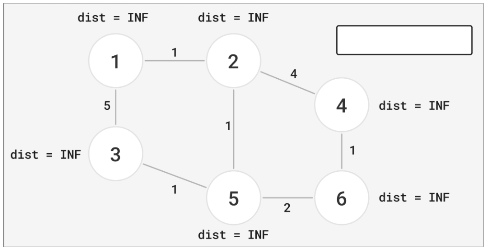

# 2-2. Dijkstra

최단거리 구할 때 사용.  

최단거리? BFS 로 구하면 되지 않나?  

그러나, cost 가 포함된 최단거리를 구할 땐 BFS 가 아니라 Dijkstra 를 사용해야 한다.  

어떤 시작점에서 모든 목적지에 대한 최단거리를 구한다는 사용례는 수도 없이 많다.  
가장 대표적으로 내비게이션, 인공지능 GPS 가 있으며, 최소 운송비 지점을 구할때도 쓰인다.  

Dijkstra 구현엔 heapq 가 쓰이므로, 해당 개념을 알고 있다고 가정하고 수업을 시작하겠다.  

먼저, 모든 노드의 `dist` 는 무한대(INF) 로 저장해둔다.  

Dijkstra 는 각 노드의 `dist` 를 구하는 알고리즘이다. 어떤 시작 노드에서 모든 각각의 노드로 가는 최단거리, 즉 `dist` 가 얼마인지를 모두 구한다.  

시작 노드를 `1` 이라고 가정하겠다. 노드 번호와, 0 (시작노드에서 시작노드로 가는 거리) 을 heapq 에 집어넣는다.  

heapq 에서 값을 꺼내는 기준이 중요한데, `cost` 가 작은 것이 먼저 나오도록 하겠다.  

그리고, 노드 `1` 의 `dist` 를 `0` 으로 갱신한다.  

- `dist[1] = 0` 은 Dijkstra 가 작동되는 동안에 절대 바뀔 일이 없다. 왜냐면 `dist[]` 의 목적이 최소 거리를 담는 것인데, 음수가 아닌 이상 0 보다 작은 수가 없기 때문이다. 즉, 비교 대상이 들어와도 가장 작은 수이기 때문에 절대로 갱신되지 않는다.  
- 다른 말로 하면, 앞으로 `dist[]` 는 값을 비교 후 최솟값으로 갱신해나간다는 뜻이다.  

현재 heapq 엔 단 하나의 값만 존재하기 때문에, 그걸 꺼낼수밖에 없다.  

heapq 에서 꺼낸 값을 파란색으로 표시하겠다.  

이제 해야할 건 무엇이겠나? 1과 연결된 것, 2와 3을 확인하러 갈 것이다.  

무조건 dist 를 갱신하고, heapq 에 집어넣진 않는다. Djikstra 의 목적은 어디까지나 최소 거리다.  
만약 현재까지 `dist` 에 기록된 거리가 더 짧다면, 기록하지 않고 heapq 에도 집어넣지 않는다.  

`1` 번 노드에서 `2` 번 노드로 가는 경우, 현재 `2` 까지 가는 거리는 INF 이므로 무조건 갱신되며, heapq 에도 들어가야만 한다.  
`1` 번 노드에서 `3` 번 노드로 가는 경우, 현재 `3` 까지 가는 거리는 INF 이므로 무조건 갱신되며, heapq 에도 들어가야만 한다.  

이제 heapq 에서 값을 꺼내야하는데, cost 가 작은 것이 먼저 나와야 하므로 `2` 가 먼저 나온다.  

`2` 가 갈 수 있는 곳을 따져보니, `1`, `4`, `5` 번이다.  
그러나, `1` 은 이미 `dist` 가 `0` 이므로 `dist` 갱신도 안 할 것이고, heapq 에도 집어넣지 않을 것이다.  
왜냐, 이미 `1` 에서 `1` 로 가는 최단거리는 `0` 으로 보장되어있기 때문이다.  

- 즉, `visited` 는 불필요하다. `dist` 비교연산에서 걸러지기 때문이다.  

나머지 `4` 와 `5` 의 `dist` 를 갱신하고, heapq 에도 집어넣자.  

이제 heapq 에서 나와야 할 것은 `cost` 가 가장 작은 `5` 이다.  

`5` 는 `2`, `3`, `6` 으로 갈 수 있는데, `3` 과 `6` 의 `dist` 를 갱신하고 heapq 에 넣어야 한다.  
특히 `3` 은 이미 `5` 라는 값이 있지만, 새로운 경로인 `3` 이 더 작은 `cost` 를 가지기에 갱신된다는 점을 주목하자.  

이제 heapq 에서 나와야 할 건 `cost` 가 `3` 인 `3` 이다.  
- 주목할만한 점으로, `cost` 가 `5` 인 `3` 도 존재한다. 나중에 이것을 꺼냈을 때 어떻게 처리하는지 주의하자.  

`3` 은 갈만한 곳이 존재하지 않으며, 아무것도 갱신되지 않는다.  

이제 `cost` 가 가장 작은 `6` 이 나와야 한다.  

`6` 도 마찬가지로 갈 수 있는 곳이 없다.  

그 다음, `3` 과 `4` 의 `cost` 가 같기 때문에, 앞 번호인 `3` 이 나온다고 가정하자.  

이 경우, 현재 `dist[3]` 에 기록된 값은 `3` 이며, heapq 에서 나온 `cost` 는 `5` 이다.  
`1` 과 `5` 를 갈 수 있지만, 해당 노드에 대한 최단거리를 다시 알아볼 필요가 전혀 없다.  
이미 기록된 값으로 `1` 과 `5` 에 접근한 거리가 최단거리이기 때문이다.  

다음, heapq 에는 `4` 가 남았다.  

갈 수 있는 곳이 전혀 없다. 최종적으로 heapq 는 텅 비게 되며, Dijkstra 는 끝나게 된다.  

